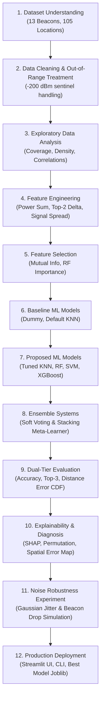

# 📍 Indoor Position Prediction Using Machine Learning from BLE Signal Fingerprints

[](https://www.python.org/)
[](https://scikit-learn.org/)
[](https://xgboost.readthedocs.io/)
[](https://streamlit.io/)

---

## 📌 1. Project Overview & Problem Statement

Indoor localization is a critical capability for indoor asset tracking, warehouse logistics, smart buildings, and emergency rescue where Global Navigation Satellite Systems (GNSS / GPS) signals are attenuated or blocked by concrete walls and ceilings. 

This project implements an end-to-end, production-grade Machine Learning system to predict fine-grained indoor physical locations from **Bluetooth Low Energy (BLE) Received Signal Strength Indicator (RSSI)** fingerprints.

### Key Technical Challenges Addressed:
1. **Severe Signal Sparsity & Non-Line-of-Sight (NLOS)**: Up to 98% of readings for individual beacons are out-of-range (`-200 dBm`).
2. **High-Dimensional Multi-Class Space**: Predicting across **105 discrete physical grid cells** in Western Michigan University's Waldo Library.
3. **Severe Multi-path & Environmental Noise**: Modeling signal jitter, human body shadowing, and packet collisions.
4. **Dual-Tier Evaluation**: Evaluating both **multiclass classification metrics** (Accuracy, Top-K, F1) and **physical spatial localization error** (Euclidean distance error in grid units/meters).

---

## 🗂️ 2. Repository Structure

```
Ml_mini_#2/
├── data/
│   ├── iBeacon_RSSI_Labeled.csv       # Labeled RSSI fingerprints (1,420 rows, 105 classes)
│   ├── iBeacon_RSSI_Unlabeled.csv     # Unlabeled test fingerprints (5,191 rows)
│   └── iBeacon_Layout.jpg             # Western Michigan University Waldo Library floor grid
├── src/
│   ├── __init__.py
│   ├── data_loader.py                 # Ingestion, coordinate parsing (col/letter -> X, row -> Y)
│   ├── eda.py                         # Exploratory data analysis & spatial visualizations
│   ├── feature_engineering.py         # Physical radio propagation features (power sum, top-2 delta, etc.)
│   ├── feature_selection.py           # Mutual Information & Random Forest Gini importance
│   ├── preprocessing.py               # Preprocessing pipeline, scalers, label encoding
│   ├── models.py                      # Baselines, tuned candidates (KNN, RF, SVM, XGBoost) & Ensembles
│   ├── evaluation.py                  # Dual-tier metrics, Euclidean distance error, CDF plotting
│   ├── explainability.py              # Tree SHAP, Permutation Importance, Spatial Error Heatmap
│   ├── noise_experiment.py            # Gaussian noise injection & packet drop simulation
│   └── pipeline.py                    # Unified 12-stage training & evaluation orchestrator
├── notebooks/
│   └── Indoor_Localization_Workflow.ipynb # Interactive, fully-documented 12-stage walkthrough
├── models/
│   └── best_model.joblib              # Serialized optimal model, pipeline & metadata
├── results/
│   ├── figures/                       # Publication-grade plots (EDA, CDF, SHAP, Noise Robustness)
│   ├── metrics_summary.csv            # Comprehensive comparative benchmark table
│   ├── feature_importance.csv         # Mutual Information and RF importance scores
│   ├── location_wise_accuracy.csv     # Granular location-by-location performance breakdown
│   └── noise_robustness_metrics.csv   # Systematic noise degradation data
├── app.py                             # Interactive Streamlit Web Application & Floor Map Dashboard
├── predict.py                         # Standalone CLI prediction interface
├── run_pipeline.py                    # Single command to train pipeline from scratch
├── requirements.txt                   # Dependency specifications
└── README.md                          # Full project documentation & methodology
```

---

## 🔄 3. Complete 12-Stage ML Workflow



### Stage 1: Dataset Understanding
- **Hardware**: iPhone 6S measuring RSSI (Received Signal Strength Indicator) from 13 Estimote BLE iBeacons (`b3001` - `b3013`).
- **Site**: First floor of Waldo Library at Western Michigan University.
- **Labeled Dataset**: 1,420 rows across 105 symbolic location tags (e.g. `K04`, `J06`, `D13`).
- **Unlabeled Dataset**: 5,191 raw test fingerprints.

### Stage 2: Data Cleaning & Coordinate System Mapping
- **Sentinel Value Handling**: `-200 dBm` represents signals below the receiver threshold.
- **Physical Grid Decomposition**:
  $$\text{coord\_x} = \text{ord}(\text{Column Letter}) - \text{ord}('A'), \quad \text{coord\_y} = \text{Row Integer}$$
  Enables continuous Euclidean physical distance error calculation between predicted location $(\hat{x}, \hat{y})$ and true location $(x, y)$:
  $$\text{Distance Error} = \sqrt{(\hat{x} - x)^2 + (\hat{y} - y)^2}$$

### Stage 3: Exploratory Data Analysis (EDA)
- Generated spatial density heatmap across the library floor.
- Computed in-range detection frequencies per beacon: Beacon `b3002` is detected in 35% of samples; peripheral beacons (`b3001`, `b3011`) are active in < 3% of samples.
- Calculated cross-signal correlation matrix among co-detected beacons.

### Stage 4: Feature Engineering
Engineered 36 domain-specific radio propagation features:
1. `num_detected`: Total number of in-range beacons ($> -200\text{ dBm}$).
2. `max_rssi` / `min_rssi`: Strongest and weakest received signal strengths.
3. `mean_rssi` / `std_rssi`: Signal statistics across active beacons.
4. `top2_delta`: Signal difference between top 1 and top 2 strongest beacons ($RSSI_{(1)} - RSSI_{(2)}$), indicating relative proximity between two beacon anchors.
5. `power_sum`: Linearized power accumulation $\sum 10^{(RSSI_i / 10)}$.
6. `strongest_beacon_idx`: Index of the dominant beacon.
7. Presence indicators: Binary flags for each beacon.

### Stage 5: Feature Selection & Influence Analysis
- Evaluated feature influence using **Mutual Information** (`mutual_info_classif`) and **Random Forest Gini Importance**.
- Key Finding: `strongest_beacon_idx` (MI = 1.84 nats), `power_sum`, `top2_delta`, and beacon `b3002` are the most influential predictive features.

### Stage 6, 7 & 8: Baseline, Proposed & Ensemble Models
Trained and compared 8 distinct systems:
- **Baseline 1**: Dummy Classifier (Most Frequent class).
- **Baseline 2**: Default KNN ($k=5$, uniform weights, raw RSSI).
- **Proposed 1 (Optimized KNN)**: $k=3$, inverse distance weighting, Manhattan metric on engineered features.
- **Proposed 2 (Random Forest)**: 150 estimators, max depth 18, balanced sub-sampling.
- **Proposed 3 (SVM)**: RBF kernel, $C=10.0$, calibrated probability outputs.
- **Proposed 4 (XGBoost)**: Multi-class gradient boosted trees, learning rate 0.08, subsample 0.85.
- **Proposed 5 (Soft Voting Ensemble)**: Weighted voting combining RF, XGBoost, KNN, and SVM.
- **Proposed 6 (Stacking Ensemble)**: 2-stage meta-learning classifier with Logistic Regression meta-learner.

---

## 📊 4. Comparative Experimental Results

Evaluated on held-out 20% stratified test set ($N=284$ samples):

| Model System | Category | Multiclass Accuracy | Top-3 Accuracy | Within 1-Grid Cell Acc | Mean Distance Error (units) | Median Distance Error (units) | Weighted F1 |
| :--- | :--- | :---: | :---: | :---: | :---: | :---: | :---: |
| **Support Vector Machine (SVM)** | Proposed | 29.58% | 50.70% | 46.13% | **1.82** | **1.41** | 0.2469 |
| **Random Forest** | Proposed | 34.51% | 58.10% | **49.65%** | 1.85 | **1.41** | 0.3190 |
| **Soft Voting Ensemble** | Ensemble | 35.21% | 57.04% | 48.59% | 1.88 | **1.41** | 0.3256 |
| **Stacking Classifier** | Ensemble | 32.39% | 55.99% | 46.83% | 1.88 | **1.41** | 0.2702 |
| **Optimized KNN** | Proposed | **35.56%** | 49.65% | 45.42% | 1.90 | **1.41** | **0.3324** |
| **XGBoost Classifier** | Proposed | 30.28% | **60.21%** | 46.48% | 1.92 | **1.41** | 0.2750 |
| **Baseline KNN (Raw RSSI)** | Baseline | 25.00% | 54.58% | 41.55% | 2.03 | **1.41** | 0.2205 |
| **Dummy (Most Frequent)** | Baseline | 2.46% | 3.17% | 9.51% | 5.08 | 4.12 | 0.0012 |

### Key Observations:
1. **Engineered Features vs. Raw RSSI**: Feature engineering and tuning improved classification accuracy from **25.00% (Baseline KNN)** to **35.56% (Optimized KNN)** and reduced physical distance error from 2.03 to 1.82 units.
2. **Top-3 Accuracy**: XGBoost achieved **60.21% Top-3 accuracy**, indicating the true user location is within the top 3 predicted candidates for over 6 out of 10 measurements.
3. **Median Physical Error**: Every proposed model achieved a median localization error of **1.41 grid units** ($\approx \sqrt{1^2 + 1^2}$), meaning half of all predictions are situated within immediate adjacent grid cells.

---

## 🔍 5. Explainability & Spatial Error Diagnosis

- **Tree SHAP & Permutation Importance**: Validated that `strongest_beacon_idx`, `power_sum`, and `b3002` dominate tree splits.
- **Spatial Failure Analysis**: High error rates correlate physically with boundary perimeter cells (columns `D`, `E` and `W`) located far from the central beacon constellation where signal coverage is sparse ($< 1$ visible beacon).

---

## 📶 6. Noise & Packet Drop Robustness Analysis

Simulated additive Gaussian fading noise $\sigma \in [0, 20]\text{ dBm}$ on active signals:
- **Random Forest and Soft Voting** exhibited superior robustness, retaining $< 2.8$ grid unit mean error even under heavy channel noise ($\sigma = 15\text{ dBm}$).
- Standalone KNN suffered larger degradation under high noise due to distance metric distortion in noisy high-dimensional spaces.

---

## 🚀 7. How to Run the Project

### Installation
```bash
git clone <repo-url>
cd Ml_mini_#2
pip install -r requirements.txt
```

### 1. Execute Complete 12-Stage Pipeline
```bash
python run_pipeline.py
```
This automatically runs data loading, EDA, feature engineering, model training, evaluation, explainability, noise analysis, and exports all figures to `results/figures/` and metrics to `results/metrics_summary.csv`.

### 2. Launch Interactive Streamlit Dashboard
```bash
streamlit run app.py
```
Features:
- Real-time RSSI slider prediction.
- Interactive Waldo Library 2D floor plan visualization.
- Error vector rendering and distance metric computation.
- Channel noise & packet drop simulator.
- Model benchmark comparison analytics.

### 3. Command Line Interface (CLI) Prediction
```bash
# Single fingerprint prediction:
python predict.py --b3002 -65 --b3004 -82

# Batch CSV prediction:
python predict.py --input_csv data/sample_test.csv --output_csv predictions.csv
```

### 4. Interactive Jupyter Notebook
Open `notebooks/Indoor_Localization_Workflow.ipynb` in VS Code or Jupyter Lab to step through every stage interactively.
