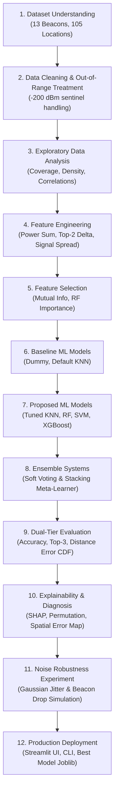

# 📍 Indoor Position Prediction Using Machine Learning from BLE Signal Fingerprints

[](https://www.python.org/)
[](https://scikit-learn.org/)
[](https://xgboost.readthedocs.io/)
[](https://streamlit.io/)

---

## ⚡ Quick Start (Run This First)

> **New to the project? Follow these 3 steps.**

**Step 1 — Install dependencies** (only once):
```bash
pip install -r requirements.txt
```

**Step 2 — Train all models** (only once, ~2 min):
```bash
python run_pipeline.py
```

**Step 3 — Launch the web app** (every time you want to use it):
```bash
python run_app.py
```
Then open your browser at **http://localhost:8501**

> ⚠️ **Important**: Always use `python run_app.py` — NOT `streamlit run app.py`.
> The `streamlit` command often fails on Windows because it requires Python's Scripts
> folder to be on the system PATH. `python run_app.py` uses `python -m streamlit`
> internally, which works on **any system, any OS, without any PATH setup**.

---

## 📌 1. Project Overview & Problem Statement

Indoor localization is a critical capability for indoor asset tracking, warehouse logistics, smart buildings, and emergency rescue where GPS signals are blocked by concrete walls and ceilings.

This project implements an end-to-end Machine Learning system to predict fine-grained indoor physical locations from **Bluetooth Low Energy (BLE) Received Signal Strength Indicator (RSSI)** fingerprints collected across Waldo Library at Western Michigan University.

### Key Technical Challenges Addressed:
1. **Severe Signal Sparsity**: Up to 98% of readings for individual beacons are out-of-range (`-200 dBm`).
2. **High-Dimensional Multi-Class Space**: Predicting across **105 discrete physical grid cells**.
3. **Environmental Noise**: Modeling multipath signal jitter, human body shadowing, and packet collisions.
4. **Dual-Tier Evaluation**: Both **classification metrics** (Accuracy, Top-K, F1) and **physical localization error** (Euclidean distance in grid units).

---

## 🗂️ 2. Repository Structure

```
Ml_mini_#2/
├── data/
│   ├── iBeacon_RSSI_Labeled.csv        # 1,420 labeled RSSI fingerprints (105 location classes)
│   ├── iBeacon_RSSI_Unlabeled.csv      # 5,191 unlabeled test fingerprints
│   └── iBeacon_Layout.jpg              # Waldo Library floor grid layout image
│
├── src/                                # Modular Python source code
│   ├── __init__.py
│   ├── data_loader.py                  # Dataset ingestion & coordinate parser (Letter → X, Row → Y)
│   ├── eda.py                          # Exploratory data analysis & spatial visualizations
│   ├── feature_engineering.py          # Radio propagation features (power sum, top-2 delta, etc.)
│   ├── feature_selection.py            # Mutual Information & RF Gini importance scoring
│   ├── preprocessing.py                # Preprocessing pipeline, scalers, label encoding
│   ├── models.py                       # Baselines, tuned candidates & ensemble architectures
│   ├── evaluation.py                   # Dual-tier metrics, distance error CDF plotting
│   ├── explainability.py               # SHAP, Permutation Importance, spatial error heatmap
│   ├── noise_experiment.py             # Gaussian noise injection & packet drop simulation
│   └── pipeline.py                     # Unified 12-stage training & evaluation orchestrator
│
├── notebooks/
│   └── Indoor_Localization_Workflow.ipynb   # Interactive 12-stage Jupyter Notebook
│
├── models/
│   └── best_model.joblib               # Serialized best model + pipeline (auto-generated)
│
├── results/                            # All outputs auto-generated by run_pipeline.py
│   ├── figures/                        # All plots (EDA, SHAP, CDF, Noise Robustness, Error Map)
│   ├── metrics_summary.csv             # Comparative model benchmark table
│   ├── feature_importance.csv          # Mutual Information & RF importance scores
│   ├── location_wise_accuracy.csv      # Per-location performance breakdown
│   └── noise_robustness_metrics.csv    # Noise degradation experiment data
│
├── app.py                              # Streamlit Web App (DO NOT run directly — use run_app.py)
├── run_app.py                          # ✅ Portable web app launcher — use this!
├── launch_app.bat                      # Windows double-click launcher (calls run_app.py)
├── launch_app.sh                       # macOS/Linux shell launcher (calls run_app.py)
├── predict.py                          # Standalone CLI prediction tool
├── run_pipeline.py                     # End-to-end training pipeline script
├── requirements.txt                    # Python dependencies
└── README.md                           # This file
```

---

## 🚀 3. How to Run — Complete Guide

### Prerequisites
- Python 3.10 or higher installed
- Run all commands from inside the project folder:
  ```
  C:\Users\madda\OneDrive\Desktop\Ml_mini_#2
  ```

---

### Step 1: Install Dependencies
```bash
pip install -r requirements.txt
```
This installs: `scikit-learn`, `xgboost`, `shap`, `streamlit`, `pandas`, `numpy`, `matplotlib`, `seaborn`, `joblib`.

---

### Step 2: Train the Full Pipeline
```bash
python run_pipeline.py
```
This runs all **12 stages** automatically:
- Loads data → EDA → Feature Engineering → Model Training → Evaluation → SHAP → Noise Tests → Saves model

All results, figures, and the trained model are saved to `results/` and `models/`.

> ⏱️ Takes approximately **2–3 minutes** on first run.

---

### Step 3: Launch the Web App

**On Windows (double-click):**
```
launch_app.bat
```

**On any OS (recommended — always works):**
```bash
python run_app.py
```

**On macOS/Linux:**
```bash
bash launch_app.sh
```

Then open your browser at: **http://localhost:8501**

> ❌ **DO NOT use** `streamlit run app.py` directly.
> It fails if Python's Scripts folder is not on your system PATH.
> `python run_app.py` solves this permanently by using `python -m streamlit` internally.

---

### Step 4 (Optional): CLI Single Prediction
Predict a location from specific beacon RSSI readings:
```bash
python predict.py --b3002 -65 --b3004 -82
```

Batch predict from a CSV file:
```bash
python predict.py --input_csv data/iBeacon_RSSI_Labeled.csv --output_csv predictions.csv
```

---

### Step 5 (Optional): Open the Jupyter Notebook
Open `notebooks/Indoor_Localization_Workflow.ipynb` in VS Code or Jupyter Lab to walk through all 12 pipeline stages interactively with explanations.

---

## 🔄 4. Complete 12-Stage ML Workflow



| Stage | What Happens |
|:---:|:---|
| 1 | Load labeled dataset (1,420 rows, 13 beacons, 105 locations) |
| 2 | Map `-200 dBm` sentinels; parse symbolic locations (`K04`) → grid coordinates `(x, y)` |
| 3 | EDA: beacon detection rates, spatial density heatmap, cross-signal correlations |
| 4 | Engineer 36 domain features: `power_sum`, `top2_delta`, `strongest_beacon_idx`, normalized RSSI |
| 5 | Rank features by Mutual Information + Random Forest Gini Importance |
| 6 | Train Dummy and Default KNN baselines on raw RSSI |
| 7 | Train Optimized KNN, Random Forest, SVM (RBF), XGBoost on engineered features |
| 8 | Build Soft Voting and Stacking ensembles from Stage 7 models |
| 9 | Evaluate all 8 models: Accuracy, Top-3, F1, Distance Error CDF |
| 10 | SHAP values, Permutation Importance, spatial error heatmap |
| 11 | Noise robustness: inject Gaussian jitter (σ = 0–20 dBm) & random beacon drops |
| 12 | Save best model (`models/best_model.joblib`) + all outputs to `results/` |

---

## 📊 5. Experimental Results

Evaluated on a held-out stratified test set (N = 284 samples, 105 classes):

| Model | Category | Accuracy | Top-3 Acc | Within 1-Grid | Mean Dist Error | Weighted F1 |
| :--- | :---: | :---: | :---: | :---: | :---: | :---: |
| **SVM (RBF)** | Proposed | 29.58% | 50.70% | 46.13% | **1.82 units** | 0.247 |
| **Random Forest** | Proposed | 34.51% | 58.10% | **49.65%** | 1.85 units | 0.319 |
| **Soft Voting Ensemble** | Ensemble | 35.21% | 57.04% | 48.59% | 1.88 units | 0.326 |
| **Stacking Classifier** | Ensemble | 32.39% | 55.99% | 46.83% | 1.88 units | 0.270 |
| **Optimized KNN** | Proposed | **35.56%** | 49.65% | 45.42% | 1.90 units | **0.332** |
| **XGBoost** | Proposed | 30.28% | **60.21%** | 46.48% | 1.92 units | 0.275 |
| Baseline KNN (raw RSSI) | Baseline | 25.00% | 54.58% | 41.55% | 2.03 units | 0.221 |
| Dummy (Most Frequent) | Baseline | 2.46% | 3.17% | 9.51% | 5.08 units | 0.001 |

**Key findings:**
- Feature engineering reduced mean localization error from **2.03 → 1.82 grid units** vs raw RSSI baseline.
- **Median error = 1.41 grid units** (≈ √2) across all proposed models — meaning half of all predictions land in an immediately adjacent cell.
- XGBoost Top-3 accuracy = **60.21%** — the true room is within the top 3 candidates 6 out of 10 times.

---

## 🔍 6. Explainability Summary

- **Most influential features**: `strongest_beacon_idx` (MI = 1.84 nats), `power_sum`, `top2_delta`, `b3002`
- **Spatial failure zones**: Boundary perimeter cells (`D`, `E`, `W` columns) have highest error due to sparse beacon coverage (< 1 beacon in range)

---

## 📶 7. Noise Robustness Summary

- **Random Forest** and **Soft Voting** were the most noise-resilient, retaining < 2.8 grid unit mean error even at σ = 15 dBm
- **Standalone KNN** degraded fastest under noise due to distance metric distortion in high-dimensional noisy spaces
